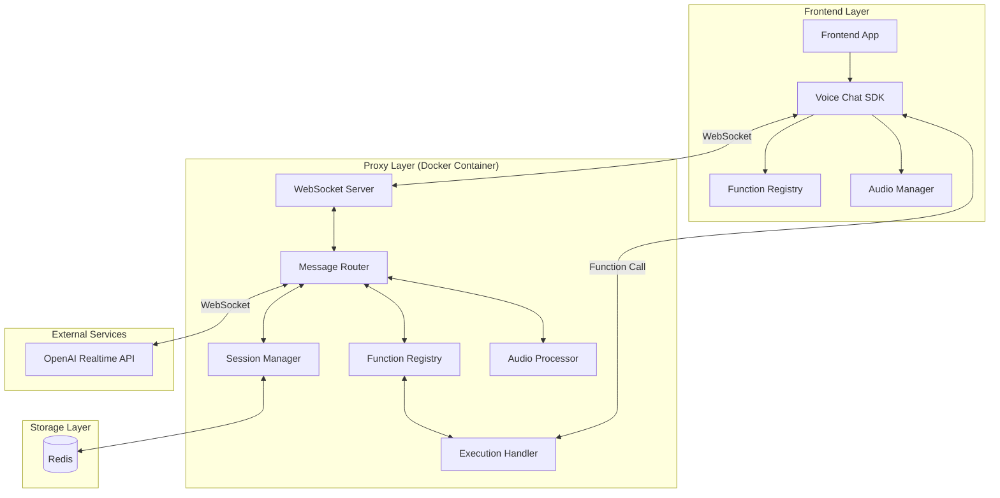

# 🏗️ System Architecture - Realtime Voice Chat GPT Proxy

## Overview

Der Realtime Voice Chat GPT Proxy ist ein hochperformanter WebSocket-basierter Proxy-Server, der als intelligente Brücke zwischen Frontend-Anwendungen und der OpenAI Realtime API fungiert. Das System ermöglicht es, Frontend-Functions dynamisch als AI-Tools zu registrieren.

## Architecture Diagram



## Core Components

### 1. Frontend Layer

#### Voice Chat SDK
- **Responsibility**: Vereinfachte API für Frontend-Entwickler
- **Key Features**:
  - WebSocket Connection Management
  - Automatic Reconnection Logic
  - Event-based Architecture
  - TypeScript Support

#### Function Registry (Frontend)
- **Responsibility**: Registrierung von JavaScript/TypeScript Functions
- **Key Features**:
  - Dynamic Function Registration
  - Schema Definition
  - Type Validation
  - Async Function Support

#### Audio Manager
- **Responsibility**: Audio Recording und Playback
- **Key Features**:
  - Web Audio API Integration
  - Audio Stream Management
  - Noise Cancellation Support
  - Volume Control

### 2. Proxy Layer (Docker Container)

#### WebSocket Server
- **Technology**: Node.js + ws library
- **Responsibilities**:
  - Client Connection Management
  - Message Validation
  - Authentication
  - Rate Limiting
- **Scaling**: Horizontal scaling mit Redis Pub/Sub

#### Message Router
- **Responsibility**: Intelligentes Message Routing
- **Message Types**:
  - Audio Streams (bidirectional)
  - Function Registrations
  - Function Calls
  - Control Messages
  - Error Messages

#### Function Registry (Proxy)
- **Responsibility**: Tool Management für OpenAI
- **Features**:
  - Function-to-Tool Conversion
  - Schema Validation
  - Version Management
  - Permission Control

#### Session Manager
- **Responsibility**: Session Lifecycle Management
- **Features**:
  - Session Creation/Destruction
  - State Persistence (Redis)
  - Reconnection Support
  - Session Timeout Handling

#### Audio Processor
- **Responsibility**: Audio Stream Processing
- **Features**:
  - Format Conversion (wenn nötig)
  - Buffer Management
  - Stream Synchronization
  - Quality Optimization

#### Execution Handler
- **Responsibility**: Function Execution Coordination
- **Flow**:
  1. Receive tool call from OpenAI
  2. Validate against registry
  3. Forward to appropriate client
  4. Await execution result
  5. Return to OpenAI

### 3. Storage Layer

#### Redis
- **Purpose**: Session Storage & Pub/Sub
- **Data Stored**:
  - Session States
  - Function Registries
  - Audio Buffers (temporary)
  - Rate Limiting Counters
- **Configuration**: Redis Cluster for HA

### 4. External Services

#### OpenAI Realtime API
- **Protocol**: WebSocket
- **Audio Format**: PCM16, 24kHz, mono
- **Features Used**:
  - Voice Conversations
  - Tool Calling
  - Session Management
  - Interruption Handling

## Data Flow

### 1. Connection Establishment
```
1. Frontend → SDK.connect(config)
2. SDK → WebSocket → Proxy
3. Proxy → Authenticate & Create Session
4. Proxy → Connect to OpenAI
5. Proxy → Store Session in Redis
6. Proxy → Return Session ID to Frontend
```

### 2. Function Registration
```
1. Frontend → SDK.registerFunction(name, fn, schema)
2. SDK → Send Registration Message
3. Proxy → Validate Schema
4. Proxy → Convert to OpenAI Tool Format
5. Proxy → Update OpenAI Session
6. Proxy → Store in Registry
7. Proxy → Confirm Registration
```

### 3. Voice Interaction
```
1. User → Microphone → Audio Manager
2. Audio Manager → Audio Stream → Proxy
3. Proxy → Buffer & Forward → OpenAI
4. OpenAI → Process & Generate Response
5. OpenAI → Audio Response → Proxy
6. Proxy → Buffer & Forward → Frontend
7. Frontend → Audio Manager → Speaker
```

### 4. Function Execution
```
1. OpenAI → Tool Call Request → Proxy
2. Proxy → Validate Tool in Registry
3. Proxy → Forward to Correct Client
4. Client → Execute Function
5. Client → Return Result
6. Proxy → Format Response
7. Proxy → Send to OpenAI
8. OpenAI → Continue Conversation
```

## Scaling Strategy

### Horizontal Scaling
- **Load Balancer**: nginx mit sticky sessions
- **Proxy Instances**: Multiple Docker containers
- **Redis Pub/Sub**: Für Cross-Instance Communication
- **Session Affinity**: Client bleibt bei gleicher Instance

### Vertical Scaling
- **CPU**: Minimum 2 cores pro Container
- **Memory**: 2GB RAM pro Container
- **Network**: 100 Mbps minimum

## Performance Considerations

### Latency Targets
- **WebSocket Connection**: < 50ms
- **Function Execution**: < 200ms
- **Audio Processing**: < 10ms buffer
- **End-to-End Voice**: < 500ms

### Optimization Techniques
1. **Connection Pooling**: Wiederverwendung von OpenAI Connections
2. **Audio Buffering**: Intelligent buffering für smooth playback
3. **Caching**: Function schemas und häufige responses
4. **Compression**: WebSocket message compression

## Security Architecture

### Authentication Flow
```
1. Client → API Key or JWT Token
2. Proxy → Validate Token
3. Proxy → Check Permissions
4. Proxy → Create Secure Session
5. Proxy → Use Own OpenAI API Key
```

### Security Measures
- **Rate Limiting**: Per client und global
- **Input Validation**: Alle messages werden validiert
- **Sandboxing**: Function execution in isolated context
- **Encryption**: TLS für alle connections
- **API Key Management**: Secure storage mit Vault

## Monitoring & Observability

### Metrics
- **System Metrics**: CPU, Memory, Network
- **Application Metrics**: 
  - Active Sessions
  - Message Throughput
  - Function Execution Times
  - Error Rates
- **Business Metrics**:
  - Usage per Client
  - Function Call Frequency
  - Audio Minutes Processed

### Logging
- **Structured Logging**: JSON format mit Winston
- **Log Levels**: ERROR, WARN, INFO, DEBUG
- **Log Aggregation**: ELK Stack oder CloudWatch

### Tracing
- **Distributed Tracing**: OpenTelemetry
- **Trace Points**:
  - WebSocket Messages
  - Function Executions
  - OpenAI API Calls

## Failure Handling

### Failure Scenarios
1. **OpenAI API Down**: Queue messages, retry mit exponential backoff
2. **Redis Down**: Fallback auf in-memory storage (mit warnings)
3. **Client Disconnect**: Maintain session für reconnection window
4. **Function Timeout**: Cancel execution, return error to OpenAI

### Recovery Strategies
- **Circuit Breaker**: Für OpenAI connections
- **Retry Logic**: Mit exponential backoff
- **Graceful Degradation**: Reduce features, maintain core functionality
- **Health Checks**: Automated recovery triggers

## Development & Deployment

### Development Environment
```bash
# Local development mit docker-compose
docker-compose up -d redis
npm run dev

# Mit hot-reload
npm run dev:watch
```

### Production Deployment
```bash
# Build Docker image
docker build -t voice-proxy:latest .

# Deploy mit docker-compose
docker-compose up -d

# Oder Kubernetes
kubectl apply -f k8s/
```

## Technology Stack Summary

| Component | Technology | Reason |
|-----------|------------|---------|
| Runtime | Node.js 20+ | Performance, TypeScript support |
| WebSocket | ws library | Lightweight, performant |
| Framework | Express | Simple HTTP endpoints |
| Session Store | Redis | Fast, supports pub/sub |
| Container | Docker | Portability, easy deployment |
| Language | TypeScript | Type safety, better DX |
| Logging | Winston | Structured logging |
| Testing | Jest | Comprehensive testing |
| Monitoring | Prometheus | Industry standard |

## Future Enhancements

1. **Multi-Language Support**: Automatic translation
2. **Voice Cloning**: Custom voice profiles
3. **Emotion Detection**: Sentiment analysis on voice
4. **Group Conversations**: Multiple users in same session
5. **Webhook Support**: Alternative to WebSocket for functions
6. **GraphQL API**: For complex data queries
7. **Plugin System**: Extensible architecture
8. **Analytics Dashboard**: Real-time usage analytics