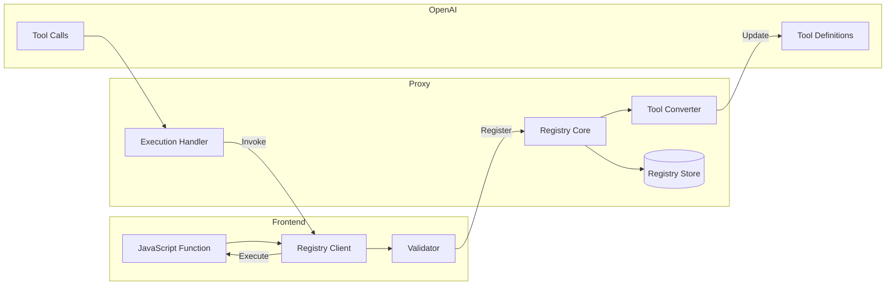

# 🔧 Function Registry System

## Overview

Das Function Registry System ist das Herzstück der dynamischen Tool-Integration. Es ermöglicht Frontend-Anwendungen, JavaScript/TypeScript Functions zur Laufzeit zu registrieren, die dann von der OpenAI Realtime API als Tools aufgerufen werden können.

## Architecture



## Function Registration Flow

### 1. Frontend Registration

```typescript
// Simple function registration
client.registerFunction(
  'calculateSum',
  (args: { a: number; b: number }) => args.a + args.b,
  {
    description: 'Adds two numbers',
    parameters: {
      type: 'object',
      properties: {
        a: { type: 'number', description: 'First number' },
        b: { type: 'number', description: 'Second number' }
      },
      required: ['a', 'b']
    }
  }
);

// Async function registration
client.registerFunction(
  'fetchUserData',
  async (args: { userId: string }) => {
    const response = await fetch(`/api/users/${args.userId}`);
    return response.json();
  },
  {
    description: 'Fetches user data from API',
    parameters: {
      type: 'object',
      properties: {
        userId: { type: 'string', description: 'User ID' }
      },
      required: ['userId']
    }
  }
);
```

### 2. Schema Validation

Das System validiert Function Schemas gegen JSON Schema Draft-07:

```typescript
interface FunctionSchema {
  name: string;
  description: string;
  parameters: JSONSchema;
  returns?: JSONSchema;
  version?: string;
  timeout?: number;        // ms, default: 5000
  retryPolicy?: {
    maxRetries: number;
    retryDelay: number;
  };
  permissions?: string[];   // Required permissions
  rateLimit?: {
    maxCalls: number;
    window: number;        // ms
  };
}
```

### 3. OpenAI Tool Conversion

Functions werden automatisch in OpenAI Tool Format konvertiert:

```typescript
// Frontend Function Schema
{
  name: 'getWeather',
  description: 'Get current weather',
  parameters: {
    type: 'object',
    properties: {
      location: { type: 'string' }
    }
  }
}

// ↓ Converted to OpenAI Tool

{
  type: 'function',
  function: {
    name: 'getWeather',
    description: 'Get current weather',
    parameters: {
      type: 'object',
      properties: {
        location: { type: 'string' }
      },
      required: ['location']
    }
  }
}
```

## Advanced Registration Features

### 1. Batch Registration

```typescript
client.registerFunctions([
  {
    name: 'func1',
    handler: () => { /* ... */ },
    schema: { /* ... */ }
  },
  {
    name: 'func2',
    handler: () => { /* ... */ },
    schema: { /* ... */ }
  }
]);
```

### 2. Conditional Registration

```typescript
// Register based on user permissions
if (user.hasPermission('admin')) {
  client.registerFunction('deleteUser', deleteUserHandler, schema);
}

// Register based on environment
if (process.env.NODE_ENV === 'development') {
  client.registerFunction('debug', debugHandler, schema);
}
```

### 3. Function Versioning

```typescript
client.registerFunction(
  'processData',
  handler,
  {
    description: 'Process data with new algorithm',
    version: '2.0.0',
    deprecated: '1.0.0',  // Mark old version as deprecated
    parameters: { /* ... */ }
  }
);
```

### 4. Function Middleware

```typescript
// Add middleware for logging, validation, etc.
client.registerFunction(
  'sensitiveOperation',
  handler,
  schema,
  {
    middleware: [
      logMiddleware,
      authMiddleware,
      validationMiddleware
    ]
  }
);

// Middleware implementation
const logMiddleware = async (args, next) => {
  console.log('Function called:', args);
  const result = await next(args);
  console.log('Function result:', result);
  return result;
};
```

## Execution Flow

### 1. Tool Call from OpenAI

```json
{
  "type": "tool_call",
  "id": "call_abc123",
  "function": {
    "name": "getWeather",
    "arguments": "{\"location\":\"Berlin\"}"
  }
}
```

### 2. Proxy Processing

```typescript
class ExecutionHandler {
  async handleToolCall(call: ToolCall) {
    // 1. Validate function exists
    const func = await this.registry.getFunction(call.function.name);
    if (!func) {
      throw new Error('Function not found');
    }

    // 2. Parse and validate arguments
    const args = JSON.parse(call.function.arguments);
    await this.validateArguments(args, func.schema);

    // 3. Check permissions
    await this.checkPermissions(func, call.sessionId);

    // 4. Apply rate limiting
    await this.rateLimiter.check(func.name, call.sessionId);

    // 5. Forward to client
    const result = await this.forwardToClient(
      call.sessionId,
      func.name,
      args,
      func.timeout
    );

    // 6. Return to OpenAI
    return {
      tool_call_id: call.id,
      output: JSON.stringify(result)
    };
  }
}
```

### 3. Client Execution

```typescript
// Client receives execution request
client.on('function.call', async (request) => {
  const { name, arguments: args, id } = request;
  
  try {
    // Get registered function
    const func = this.functions.get(name);
    
    // Execute with timeout
    const result = await Promise.race([
      func.handler(args),
      this.timeout(func.timeout)
    ]);
    
    // Send result back
    this.send({
      type: 'function.result',
      id,
      data: { success: true, result }
    });
  } catch (error) {
    // Send error back
    this.send({
      type: 'function.result',
      id,
      data: { 
        success: false, 
        error: { 
          message: error.message,
          code: 'EXECUTION_ERROR'
        }
      }
    });
  }
});
```

## Registry Storage

### Redis Schema

```typescript
// Function definition storage
{
  key: 'function:${sessionId}:${functionName}',
  value: {
    name: string,
    schema: FunctionSchema,
    version: string,
    registered: Date,
    lastCalled: Date,
    callCount: number,
    avgExecutionTime: number,
    errorRate: number
  }
}

// Session functions index
{
  key: 'session:${sessionId}:functions',
  value: Set<functionName>
}

// Global function stats
{
  key: 'stats:function:${functionName}',
  value: {
    totalCalls: number,
    totalErrors: number,
    avgExecutionTime: number,
    lastError: string
  }
}
```

## Security Considerations

### 1. Input Validation

```typescript
class FunctionValidator {
  validateArguments(args: any, schema: JSONSchema) {
    // JSON Schema validation
    const valid = ajv.validate(schema, args);
    if (!valid) {
      throw new ValidationError(ajv.errors);
    }

    // Additional security checks
    this.checkForInjection(args);
    this.validateSize(args);
    this.sanitizeInputs(args);
  }

  checkForInjection(args: any) {
    // Check for SQL injection patterns
    // Check for NoSQL injection patterns
    // Check for command injection patterns
  }
}
```

### 2. Execution Sandbox

```typescript
// Execute functions in isolated context
class Sandbox {
  async execute(func: Function, args: any) {
    // Option 1: Worker threads (Node.js)
    const worker = new Worker('./function-worker.js');
    
    // Option 2: VM2 sandbox
    const vm = new VM({
      timeout: 5000,
      sandbox: {
        args,
        fetch: limitedFetch,
        console: safeConsole
      }
    });
    
    return vm.run(func.toString());
  }
}
```

### 3. Permission System

```typescript
interface FunctionPermissions {
  requiredRoles?: string[];
  requiredScopes?: string[];
  allowedOrigins?: string[];
  maxCallsPerHour?: number;
  requiresAudit?: boolean;
}

// Check before execution
async function checkPermission(
  func: RegisteredFunction,
  session: Session
): Promise<boolean> {
  if (func.permissions?.requiredRoles) {
    if (!hasAllRoles(session.user, func.permissions.requiredRoles)) {
      return false;
    }
  }
  
  if (func.permissions?.requiresAudit) {
    await auditLog.record({
      action: 'function_call',
      function: func.name,
      user: session.user,
      timestamp: Date.now()
    });
  }
  
  return true;
}
```

## Performance Optimization

### 1. Function Caching

```typescript
class FunctionCache {
  private cache = new LRU<string, any>({
    max: 500,
    ttl: 1000 * 60 * 5 // 5 minutes
  });

  async execute(name: string, args: any): Promise<any> {
    const cacheKey = `${name}:${JSON.stringify(args)}`;
    
    // Check cache
    if (this.cache.has(cacheKey)) {
      return this.cache.get(cacheKey);
    }
    
    // Execute and cache
    const result = await this.executeFunction(name, args);
    this.cache.set(cacheKey, result);
    
    return result;
  }
}
```

### 2. Parallel Execution

```typescript
// Execute multiple functions in parallel
async function executeParallel(calls: ToolCall[]) {
  const promises = calls.map(call => 
    this.executionHandler.handleToolCall(call)
      .catch(error => ({
        tool_call_id: call.id,
        error: error.message
      }))
  );
  
  return Promise.all(promises);
}
```

### 3. Connection Pooling

```typescript
class ClientConnectionPool {
  private connections = new Map<string, WebSocket>();
  
  async getConnection(sessionId: string): Promise<WebSocket> {
    if (!this.connections.has(sessionId)) {
      throw new Error('No active connection');
    }
    
    const conn = this.connections.get(sessionId);
    if (conn.readyState !== WebSocket.OPEN) {
      this.connections.delete(sessionId);
      throw new Error('Connection not ready');
    }
    
    return conn;
  }
}
```

## Monitoring & Analytics

### Metrics to Track

```typescript
interface FunctionMetrics {
  // Performance
  executionTime: Histogram;
  successRate: Gauge;
  errorRate: Gauge;
  
  // Usage
  callsPerMinute: Counter;
  uniqueUsers: Set<string>;
  
  // Errors
  errorTypes: Map<string, number>;
  lastError: Date;
  
  // Business
  costPerCall: number;
  revenueImpact: number;
}
```

### Monitoring Implementation

```typescript
class FunctionMonitor {
  private metrics = new Metrics();
  
  async recordExecution(
    name: string,
    duration: number,
    success: boolean,
    error?: Error
  ) {
    // Record metrics
    this.metrics.histogram('function.execution.time', duration, { name });
    this.metrics.increment('function.calls', { name, success });
    
    if (error) {
      this.metrics.increment('function.errors', { 
        name, 
        type: error.constructor.name 
      });
    }
    
    // Alert on anomalies
    if (duration > 5000) {
      await this.alert('Slow function execution', { name, duration });
    }
    
    if (this.getErrorRate(name) > 0.1) {
      await this.alert('High error rate', { name });
    }
  }
}
```

## Best Practices

### 1. Function Design

```typescript
// ✅ Good: Pure function with clear interface
client.registerFunction(
  'calculateDiscount',
  ({ price, percentage }: { price: number; percentage: number }) => {
    return price * (1 - percentage / 100);
  },
  schema
);

// ❌ Bad: Side effects and unclear dependencies
client.registerFunction(
  'processOrder',
  async () => {
    const order = globalOrderState; // Bad: relies on global state
    await updateDatabase(order);     // Bad: side effect
    sendEmail(order.user);          // Bad: another side effect
    return 'done';                  // Bad: uninformative return
  },
  schema
);
```

### 2. Error Handling

```typescript
// ✅ Good: Comprehensive error handling
client.registerFunction(
  'fetchData',
  async (args) => {
    try {
      const data = await api.fetch(args.id);
      
      if (!data) {
        throw new Error('Data not found');
      }
      
      return {
        success: true,
        data: transformData(data)
      };
    } catch (error) {
      logger.error('Fetch failed', { args, error });
      
      // Return structured error
      return {
        success: false,
        error: {
          code: error.code || 'UNKNOWN_ERROR',
          message: error.message,
          retryable: isRetryable(error)
        }
      };
    }
  },
  schema
);
```

### 3. Schema Definition

```typescript
// ✅ Good: Detailed schema with validation
const schema = {
  description: 'Search for products with filters',
  parameters: {
    type: 'object',
    properties: {
      query: {
        type: 'string',
        description: 'Search query',
        minLength: 1,
        maxLength: 100
      },
      filters: {
        type: 'object',
        properties: {
          category: {
            type: 'string',
            enum: ['electronics', 'clothing', 'books']
          },
          priceRange: {
            type: 'object',
            properties: {
              min: { type: 'number', minimum: 0 },
              max: { type: 'number', minimum: 0 }
            }
          }
        }
      },
      limit: {
        type: 'integer',
        minimum: 1,
        maximum: 100,
        default: 10
      }
    },
    required: ['query']
  },
  returns: {
    type: 'array',
    items: {
      type: 'object',
      properties: {
        id: { type: 'string' },
        name: { type: 'string' },
        price: { type: 'number' }
      }
    }
  }
};
```

## Testing Functions

### Unit Testing

```typescript
describe('Weather Function', () => {
  let client: VoiceChatClient;
  
  beforeEach(() => {
    client = new VoiceChatClient({ /* ... */ });
  });
  
  it('should return weather data', async () => {
    const mockWeatherAPI = jest.fn().mockResolvedValue({
      temperature: 20,
      condition: 'sunny'
    });
    
    client.registerFunction(
      'getWeather',
      mockWeatherAPI,
      weatherSchema
    );
    
    const result = await client.executeFunction('getWeather', {
      location: 'Berlin'
    });
    
    expect(mockWeatherAPI).toHaveBeenCalledWith({ location: 'Berlin' });
    expect(result).toEqual({
      temperature: 20,
      condition: 'sunny'
    });
  });
  
  it('should handle errors gracefully', async () => {
    const mockWeatherAPI = jest.fn().mockRejectedValue(
      new Error('API unavailable')
    );
    
    client.registerFunction(
      'getWeather',
      mockWeatherAPI,
      weatherSchema
    );
    
    const result = await client.executeFunction('getWeather', {
      location: 'Berlin'
    });
    
    expect(result).toEqual({
      success: false,
      error: expect.objectContaining({
        message: 'API unavailable'
      })
    });
  });
});
```

### Integration Testing

```typescript
describe('Function Registry Integration', () => {
  it('should register and execute via OpenAI', async () => {
    // Setup mock OpenAI connection
    const mockOpenAI = new MockOpenAIConnection();
    
    // Register function
    await client.registerFunction('testFunc', handler, schema);
    
    // Simulate tool call from OpenAI
    const toolCall = {
      type: 'tool_call',
      function: {
        name: 'testFunc',
        arguments: '{"param":"value"}'
      }
    };
    
    // Execute and verify
    const result = await proxy.handleToolCall(toolCall);
    
    expect(result).toBeDefined();
    expect(handler).toHaveBeenCalledWith({ param: 'value' });
  });
});
```