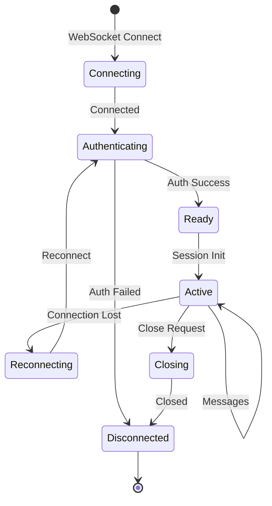

# 🔌 WebSocket Protocol Specification

## Overview

Dieses Dokument definiert das WebSocket-Protokoll für die Kommunikation zwischen Frontend-Clients und dem Voice Chat GPT Proxy. Das Protokoll basiert auf JSON-Messages mit klaren Typen und Strukturen.

## Connection Lifecycle



## Protocol Basics

### Message Structure

All messages MUST follow this structure:

```typescript
interface BaseMessage {
  type: string;           // Message type identifier
  id?: string;           // Optional unique message ID for request-response correlation
  timestamp: number;      // Unix timestamp in milliseconds
  version?: string;       // Protocol version (default: "1.0")
  data: any;             // Message-specific payload
}
```

### Message Types

Messages are categorized into domains:

- `session.*` - Session management
- `function.*` - Function registry operations
- `audio.*` - Audio streaming and control
- `conversation.*` - Conversation control
- `status.*` - Status updates
- `error.*` - Error reporting
- `system.*` - System messages

## Connection Establishment

### 1. WebSocket Handshake

```http
GET /ws HTTP/1.1
Host: proxy.example.com
Upgrade: websocket
Connection: Upgrade
Sec-WebSocket-Key: x3JJHMbDL1EzLkh9GBhXDw==
Sec-WebSocket-Version: 13
Authorization: Bearer <token>
X-Client-Version: 1.0.0
X-Client-Id: client_abc123
```

### 2. Server Response

```http
HTTP/1.1 101 Switching Protocols
Upgrade: websocket
Connection: Upgrade
Sec-WebSocket-Accept: HSmrc0sMlYUkAGmm5OPpG2HaGWk=
X-Session-Id: sess_xyz789
X-Protocol-Version: 1.0
```

### 3. Initial Handshake

After connection, the server sends a welcome message:

```json
{
  "type": "system.welcome",
  "timestamp": 1705312800000,
  "data": {
    "sessionId": "sess_xyz789",
    "protocolVersion": "1.0",
    "serverVersion": "2.3.0",
    "features": ["audio", "functions", "interrupts"],
    "limits": {
      "maxFunctions": 50,
      "maxAudioDuration": 3600,
      "maxMessageSize": 1048576
    }
  }
}
```

## Authentication

### Token-Based Auth

```json
{
  "type": "auth.token",
  "timestamp": 1705312800100,
  "data": {
    "token": "Bearer eyJhbGciOiJIUzI1NiIs...",
    "clientId": "client_abc123"
  }
}
```

**Success Response:**
```json
{
  "type": "auth.success",
  "timestamp": 1705312800200,
  "data": {
    "userId": "user_123",
    "permissions": ["audio", "functions"],
    "quotas": {
      "audioMinutes": 1000,
      "functionCalls": 10000
    }
  }
}
```

**Failure Response:**
```json
{
  "type": "auth.failed",
  "timestamp": 1705312800200,
  "data": {
    "code": "INVALID_TOKEN",
    "message": "Authentication token is invalid or expired"
  }
}
```

## Session Management

### Session Initialization

```json
{
  "type": "session.init",
  "id": "msg_001",
  "timestamp": 1705312801000,
  "data": {
    "config": {
      "model": "gpt-4-realtime",
      "voice": "alloy",
      "temperature": 0.7,
      "instructions": "You are a helpful assistant",
      "language": "en-US",
      "tools": ["functions"],
      "audioConfig": {
        "inputFormat": "pcm16",
        "outputFormat": "pcm16",
        "sampleRate": 24000,
        "channels": 1,
        "echoCancellation": true,
        "noiseSuppression": true
      }
    }
  }
}
```

### Session Resume

For reconnecting to existing sessions:

```json
{
  "type": "session.resume",
  "id": "msg_002",
  "timestamp": 1705312802000,
  "data": {
    "sessionId": "sess_xyz789",
    "lastMessageId": "msg_999",
    "lastTimestamp": 1705312790000
  }
}
```

## Audio Protocol

### Audio Streaming Format

Audio is transmitted as base64-encoded PCM16 data in chunks:

```json
{
  "type": "audio.stream",
  "timestamp": 1705312803000,
  "data": {
    "audio": "base64_encoded_pcm16_chunk",
    "sequenceNumber": 1,
    "isFirst": true,
    "isLast": false,
    "duration": 100,  // milliseconds
    "metadata": {
      "format": "pcm16",
      "sampleRate": 24000,
      "channels": 1,
      "bitDepth": 16
    }
  }
}
```

### Audio Control Commands

```json
{
  "type": "audio.control",
  "id": "msg_003",
  "timestamp": 1705312804000,
  "data": {
    "command": "stop|pause|resume|clear|mute|unmute",
    "parameters": {
      "fadeOut": 200,  // milliseconds for fadeout
      "preserveBuffer": false
    }
  }
}
```

### Voice Activity Detection (VAD)

```json
{
  "type": "audio.vad",
  "timestamp": 1705312805000,
  "data": {
    "event": "speech_start|speech_end|silence",
    "confidence": 0.95,
    "energy": 0.8,
    "duration": 1500  // milliseconds
  }
}
```

## Function Protocol

### Function Registration Message

```json
{
  "type": "function.register",
  "id": "msg_004",
  "timestamp": 1705312806000,
  "data": {
    "name": "searchDatabase",
    "description": "Search the company database",
    "parameters": {
      "type": "object",
      "properties": {
        "query": {
          "type": "string",
          "description": "Search query"
        },
        "filters": {
          "type": "object",
          "properties": {
            "department": { "type": "string" },
            "dateRange": {
              "type": "object",
              "properties": {
                "from": { "type": "string", "format": "date" },
                "to": { "type": "string", "format": "date" }
              }
            }
          }
        },
        "limit": {
          "type": "integer",
          "minimum": 1,
          "maximum": 100,
          "default": 10
        }
      },
      "required": ["query"]
    },
    "options": {
      "timeout": 10000,
      "cacheable": true,
      "cacheTTL": 300000,
      "rateLimit": {
        "maxCalls": 100,
        "window": 60000
      }
    }
  }
}
```

### Function Call Protocol

When OpenAI wants to call a function:

```json
{
  "type": "function.call",
  "id": "call_001",
  "timestamp": 1705312807000,
  "data": {
    "callId": "openai_call_abc123",
    "name": "searchDatabase",
    "arguments": {
      "query": "quarterly reports",
      "filters": {
        "department": "finance"
      },
      "limit": 5
    },
    "timeout": 10000,
    "context": {
      "conversationId": "conv_123",
      "turnId": "turn_456"
    }
  }
}
```

**Function Result Response:**

```json
{
  "type": "function.result",
  "id": "call_001",
  "timestamp": 1705312807500,
  "data": {
    "callId": "openai_call_abc123",
    "success": true,
    "result": {
      "documents": [
        {
          "id": "doc_1",
          "title": "Q3 2024 Financial Report",
          "summary": "..."
        }
      ],
      "totalCount": 5
    },
    "executionTime": 450,
    "cached": false
  }
}
```

**Function Error Response:**

```json
{
  "type": "function.error",
  "id": "call_001",
  "timestamp": 1705312807500,
  "data": {
    "callId": "openai_call_abc123",
    "error": {
      "code": "DATABASE_ERROR",
      "message": "Failed to connect to database",
      "details": {
        "retryable": true,
        "retryAfter": 5000
      }
    }
  }
}
```

## Conversation Protocol

### Transcription Updates

```json
{
  "type": "conversation.transcription",
  "timestamp": 1705312808000,
  "data": {
    "text": "What's the weather like today?",
    "isFinal": true,
    "confidence": 0.95,
    "language": "en-US",
    "speaker": "user",
    "alternatives": [
      {
        "text": "What's the weather like to day?",
        "confidence": 0.85
      }
    ]
  }
}
```

### AI Response Streaming

```json
{
  "type": "conversation.response",
  "timestamp": 1705312809000,
  "data": {
    "text": "Let me check the weather for you.",
    "delta": "Let me check",
    "isComplete": false,
    "turnId": "turn_789",
    "metadata": {
      "model": "gpt-4-realtime",
      "tokensUsed": 15
    }
  }
}
```

### Conversation Interruption

```json
{
  "type": "conversation.interrupt",
  "id": "msg_005",
  "timestamp": 1705312810000,
  "data": {
    "reason": "user_interrupt|system|timeout",
    "preserveContext": true,
    "message": "Actually, never mind about that"
  }
}
```

## Status Updates

### Connection Status

```json
{
  "type": "status.connection",
  "timestamp": 1705312811000,
  "data": {
    "state": "connected|reconnecting|disconnected",
    "latency": 45,
    "quality": "excellent|good|fair|poor"
  }
}
```

### Processing Status

```json
{
  "type": "status.processing",
  "timestamp": 1705312812000,
  "data": {
    "state": "idle|listening|processing|speaking|thinking",
    "details": "Analyzing your request...",
    "progress": 0.7
  }
}
```

## Error Handling

### Error Message Structure

```json
{
  "type": "error",
  "timestamp": 1705312813000,
  "data": {
    "code": "ERROR_CODE",
    "message": "Human-readable error message",
    "severity": "fatal|error|warning|info",
    "context": {
      "operation": "function.call",
      "messageId": "msg_123"
    },
    "recovery": {
      "retryable": true,
      "retryAfter": 1000,
      "fallback": "alternative_action"
    },
    "stack": "Error stack trace (dev mode only)"
  }
}
```

### Error Codes

| Code | Description | Severity | Retryable |
|------|-------------|----------|-----------|
| `WS_1001` | Protocol version mismatch | fatal | no |
| `WS_1002` | Invalid message format | error | no |
| `WS_1003` | Message too large | error | no |
| `AUTH_2001` | Authentication required | error | yes |
| `AUTH_2002` | Invalid credentials | error | no |
| `AUTH_2003` | Token expired | warning | yes |
| `SESSION_3001` | Session not found | error | no |
| `SESSION_3002` | Session expired | warning | yes |
| `SESSION_3003` | Session limit reached | error | no |
| `FUNC_4001` | Function not found | error | no |
| `FUNC_4002` | Function timeout | warning | yes |
| `FUNC_4003` | Function execution error | error | maybe |
| `FUNC_4004` | Invalid function arguments | error | no |
| `AUDIO_5001` | Invalid audio format | error | no |
| `AUDIO_5002` | Audio buffer overflow | warning | yes |
| `AUDIO_5003` | Audio processing error | error | yes |
| `RATE_6001` | Rate limit exceeded | warning | yes |
| `OPENAI_7001` | OpenAI API error | error | yes |
| `OPENAI_7002` | OpenAI quota exceeded | error | no |
| `SYSTEM_9001` | Internal server error | error | yes |
| `SYSTEM_9002` | Service unavailable | error | yes |

## Heartbeat & Keep-Alive

### Ping-Pong Protocol

Client sends:
```json
{
  "type": "system.ping",
  "timestamp": 1705312814000,
  "data": {
    "sequence": 1
  }
}
```

Server responds:
```json
{
  "type": "system.pong",
  "timestamp": 1705312814010,
  "data": {
    "sequence": 1,
    "serverTime": 1705312814010
  }
}
```

Recommended: Send ping every 30 seconds to maintain connection.

## Binary Protocol Extension

For high-performance audio streaming, binary frames can be used:

### Binary Frame Structure

```
[1 byte: frame type][4 bytes: timestamp][2 bytes: sequence][N bytes: payload]

Frame Types:
0x01 - Audio data
0x02 - Control command
0x03 - Metadata
```

### Audio Binary Frame

```
[0x01][timestamp][sequence][PCM16 audio data]
```

Example implementation:
```javascript
// Sending binary audio
const frameType = new Uint8Array([0x01]);
const timestamp = new Uint32Array([Date.now()]);
const sequence = new Uint16Array([seqNum]);
const audioData = new Int16Array(pcmBuffer);

const message = new Uint8Array(
  frameType.byteLength + 
  timestamp.byteLength + 
  sequence.byteLength + 
  audioData.byteLength
);

// Combine buffers
message.set(frameType, 0);
message.set(new Uint8Array(timestamp.buffer), 1);
message.set(new Uint8Array(sequence.buffer), 5);
message.set(new Uint8Array(audioData.buffer), 7);

ws.send(message);
```

## Flow Control

### Backpressure Handling

When the server is overwhelmed:

```json
{
  "type": "system.backpressure",
  "timestamp": 1705312815000,
  "data": {
    "level": "warning|critical",
    "bufferUsage": 0.85,
    "recommendation": "reduce_rate|pause_sending",
    "resumeAfter": 1000
  }
}
```

### Rate Limiting

```json
{
  "type": "system.rateLimit",
  "timestamp": 1705312816000,
  "data": {
    "limited": true,
    "limit": 100,
    "remaining": 5,
    "resetAt": 1705312900000,
    "retryAfter": 84000
  }
}
```

## Message Ordering & Reliability

### Message Acknowledgment

For critical messages requiring confirmation:

```json
{
  "type": "any.message",
  "id": "msg_critical_001",
  "requiresAck": true,
  "timestamp": 1705312817000,
  "data": { /* ... */ }
}
```

Acknowledgment:
```json
{
  "type": "system.ack",
  "ackId": "msg_critical_001",
  "timestamp": 1705312817050,
  "data": {
    "received": true,
    "processed": true
  }
}
```

### Message Sequencing

For ordered delivery:

```json
{
  "type": "any.message",
  "sequence": 42,
  "timestamp": 1705312818000,
  "data": { /* ... */ }
}
```

## Compression

WebSocket compression is supported via per-message deflate:

```http
Sec-WebSocket-Extensions: permessage-deflate; client_max_window_bits
```

This is especially useful for large function results and transcriptions.

## Security Considerations

### Message Validation

1. **Size Limits**: Messages must not exceed 1MB
2. **Rate Limiting**: Max 1000 messages per minute per client
3. **Schema Validation**: All messages validated against JSON schema
4. **Injection Prevention**: Sanitize all user input
5. **Timeout Protection**: Auto-disconnect idle connections after 5 minutes

### Encryption

- Always use WSS (WebSocket Secure) in production
- TLS 1.3 recommended
- Certificate pinning for mobile clients

## Client Implementation Example

```javascript
class VoiceChatWebSocket {
  constructor(url, options) {
    this.url = url;
    this.options = options;
    this.messageQueue = [];
    this.messageHandlers = new Map();
    this.sequence = 0;
  }

  connect() {
    this.ws = new WebSocket(this.url);
    
    this.ws.onopen = () => {
      console.log('Connected');
      this.flushQueue();
    };
    
    this.ws.onmessage = (event) => {
      const message = JSON.parse(event.data);
      this.handleMessage(message);
    };
    
    this.ws.onerror = (error) => {
      console.error('WebSocket error:', error);
      this.reconnect();
    };
    
    this.ws.onclose = (event) => {
      console.log('Disconnected:', event.code, event.reason);
      if (event.code !== 1000) {
        this.reconnect();
      }
    };
  }

  send(type, data, options = {}) {
    const message = {
      type,
      timestamp: Date.now(),
      data,
      ...options
    };
    
    if (options.requiresAck) {
      message.id = `msg_${++this.sequence}`;
      return this.sendWithAck(message);
    }
    
    if (this.ws.readyState === WebSocket.OPEN) {
      this.ws.send(JSON.stringify(message));
    } else {
      this.messageQueue.push(message);
    }
  }

  sendWithAck(message) {
    return new Promise((resolve, reject) => {
      const timeout = setTimeout(() => {
        reject(new Error('Message acknowledgment timeout'));
      }, 5000);
      
      this.messageHandlers.set(message.id, (ack) => {
        clearTimeout(timeout);
        resolve(ack);
      });
      
      this.ws.send(JSON.stringify(message));
    });
  }

  handleMessage(message) {
    // Handle acknowledgments
    if (message.type === 'system.ack') {
      const handler = this.messageHandlers.get(message.ackId);
      if (handler) {
        handler(message);
        this.messageHandlers.delete(message.ackId);
      }
      return;
    }
    
    // Emit message event
    this.emit(message.type, message.data);
  }

  reconnect() {
    setTimeout(() => {
      console.log('Reconnecting...');
      this.connect();
    }, this.getBackoffDelay());
  }

  getBackoffDelay() {
    // Exponential backoff with jitter
    const base = Math.min(30000, Math.pow(2, this.reconnectAttempts++) * 1000);
    return base + Math.random() * 1000;
  }

  flushQueue() {
    while (this.messageQueue.length > 0) {
      const message = this.messageQueue.shift();
      this.ws.send(JSON.stringify(message));
    }
  }
}
```

## Testing the Protocol

### Using wscat

```bash
# Connect
wscat -c ws://localhost:8080/ws

# Send messages
> {"type":"session.init","timestamp":1705312800000,"data":{"config":{"model":"gpt-4-realtime"}}}

> {"type":"function.register","timestamp":1705312801000,"data":{"name":"test","parameters":{}}}
```

### Protocol Compliance Testing

```javascript
describe('WebSocket Protocol', () => {
  it('should follow message structure', () => {
    const message = {
      type: 'test.message',
      timestamp: Date.now(),
      data: { test: true }
    };
    
    expect(message).toMatchSchema(messageSchema);
  });
  
  it('should handle connection lifecycle', async () => {
    const client = new TestClient();
    
    await client.connect();
    expect(client.state).toBe('connected');
    
    await client.authenticate();
    expect(client.state).toBe('authenticated');
    
    await client.initSession();
    expect(client.state).toBe('ready');
  });
});
```