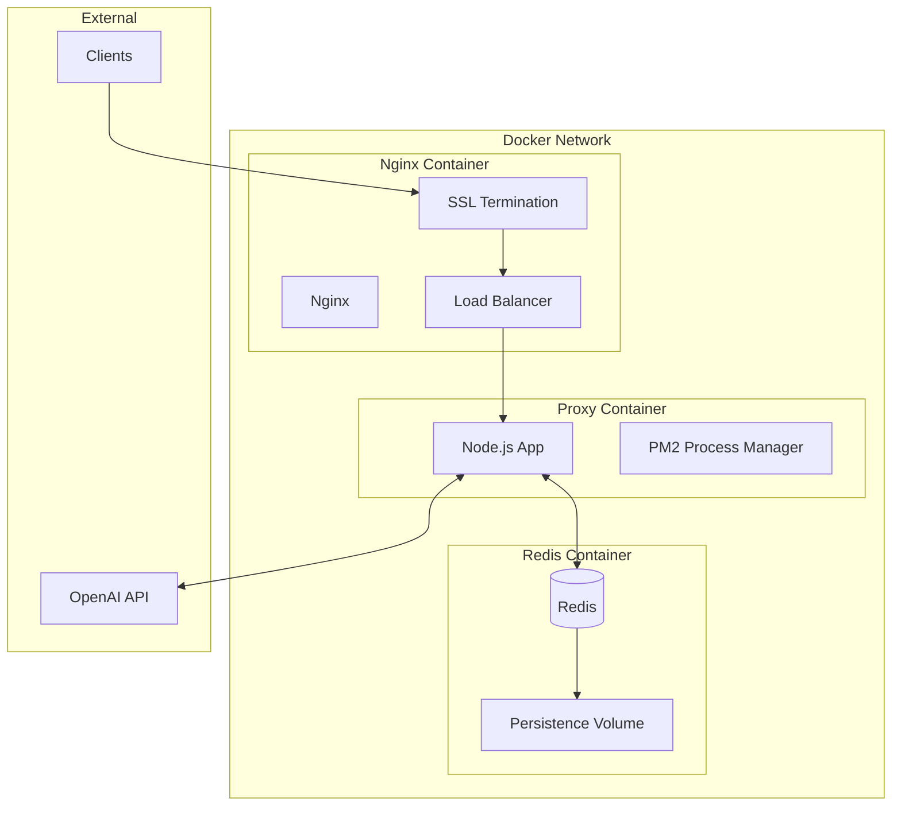

# 🐳 Docker Deployment Guide

## Overview

Dieser Guide beschreibt die Containerisierung und das Deployment des Voice Chat GPT Proxy als Docker Container. Die Lösung ist optimiert für Production-Deployments mit Skalierbarkeit, Monitoring und Security.

## Docker Architecture



## Dockerfile

### Multi-Stage Production Dockerfile

```dockerfile
# Build stage
FROM node:20-alpine AS builder

# Install build dependencies
RUN apk add --no-cache python3 make g++

WORKDIR /app

# Copy package files
COPY proxy/package*.json ./
COPY proxy/tsconfig.json ./

# Install dependencies
RUN npm ci --only=production && \
    npm cache clean --force

# Copy source code
COPY proxy/src ./src

# Build TypeScript
RUN npm run build

# Remove dev dependencies
RUN npm prune --production

# Production stage
FROM node:20-alpine

# Install PM2 globally
RUN npm install -g pm2

# Create non-root user
RUN addgroup -g 1001 -S nodejs && \
    adduser -S nodejs -u 1001

WORKDIR /app

# Copy built application
COPY --from=builder --chown=nodejs:nodejs /app/dist ./dist
COPY --from=builder --chown=nodejs:nodejs /app/node_modules ./node_modules
COPY --from=builder --chown=nodejs:nodejs /app/package*.json ./

# Copy PM2 configuration
COPY --chown=nodejs:nodejs ecosystem.config.js ./

# Create necessary directories
RUN mkdir -p /app/logs && \
    chown -R nodejs:nodejs /app/logs

# Switch to non-root user
USER nodejs

# Health check
HEALTHCHECK --interval=30s --timeout=3s --start-period=5s --retries=3 \
    CMD node healthcheck.js || exit 1

# Expose port
EXPOSE 8080

# Start with PM2
CMD ["pm2-runtime", "start", "ecosystem.config.js"]
```

### Development Dockerfile

```dockerfile
FROM node:20-alpine

WORKDIR /app

# Install development tools
RUN apk add --no-cache python3 make g++ git

# Install nodemon globally for hot-reload
RUN npm install -g nodemon typescript

# Copy package files
COPY proxy/package*.json ./
COPY proxy/tsconfig.json ./

# Install all dependencies (including dev)
RUN npm install

# Copy source code
COPY proxy/src ./src

# Volume for source code (for hot-reload)
VOLUME ["/app/src"]

# Expose port and debugger port
EXPOSE 8080 9229

# Start with nodemon for hot-reload
CMD ["nodemon", "--inspect=0.0.0.0:9229", "src/server.ts"]
```

## Docker Compose Configuration

### Production docker-compose.yml

```yaml
version: '3.8'

services:
  nginx:
    image: nginx:alpine
    container_name: voice-proxy-nginx
    ports:
      - "80:80"
      - "443:443"
    volumes:
      - ./nginx/nginx.conf:/etc/nginx/nginx.conf:ro
      - ./nginx/ssl:/etc/nginx/ssl:ro
      - nginx-cache:/var/cache/nginx
    depends_on:
      - proxy1
      - proxy2
      - proxy3
    networks:
      - voice-network
    restart: unless-stopped
    logging:
      driver: "json-file"
      options:
        max-size: "10m"
        max-file: "3"

  proxy1:
    build:
      context: .
      dockerfile: proxy/Dockerfile
    container_name: voice-proxy-1
    environment:
      - NODE_ENV=production
      - PORT=8080
      - INSTANCE_ID=proxy-1
      - REDIS_URL=redis://redis:6379
      - OPENAI_API_KEY=${OPENAI_API_KEY}
      - LOG_LEVEL=${LOG_LEVEL:-info}
    depends_on:
      redis:
        condition: service_healthy
    networks:
      - voice-network
    restart: unless-stopped
    deploy:
      resources:
        limits:
          cpus: '2'
          memory: 2G
        reservations:
          cpus: '1'
          memory: 1G

  proxy2:
    build:
      context: .
      dockerfile: proxy/Dockerfile
    container_name: voice-proxy-2
    environment:
      - NODE_ENV=production
      - PORT=8080
      - INSTANCE_ID=proxy-2
      - REDIS_URL=redis://redis:6379
      - OPENAI_API_KEY=${OPENAI_API_KEY}
      - LOG_LEVEL=${LOG_LEVEL:-info}
    depends_on:
      redis:
        condition: service_healthy
    networks:
      - voice-network
    restart: unless-stopped
    deploy:
      resources:
        limits:
          cpus: '2'
          memory: 2G
        reservations:
          cpus: '1'
          memory: 1G

  proxy3:
    build:
      context: .
      dockerfile: proxy/Dockerfile
    container_name: voice-proxy-3
    environment:
      - NODE_ENV=production
      - PORT=8080
      - INSTANCE_ID=proxy-3
      - REDIS_URL=redis://redis:6379
      - OPENAI_API_KEY=${OPENAI_API_KEY}
      - LOG_LEVEL=${LOG_LEVEL:-info}
    depends_on:
      redis:
        condition: service_healthy
    networks:
      - voice-network
    restart: unless-stopped
    deploy:
      resources:
        limits:
          cpus: '2'
          memory: 2G
        reservations:
          cpus: '1'
          memory: 1G

  redis:
    image: redis:7-alpine
    container_name: voice-proxy-redis
    command: redis-server --appendonly yes --maxmemory 512mb --maxmemory-policy allkeys-lru
    ports:
      - "127.0.0.1:6379:6379"
    volumes:
      - redis-data:/data
      - ./redis/redis.conf:/usr/local/etc/redis/redis.conf:ro
    networks:
      - voice-network
    restart: unless-stopped
    healthcheck:
      test: ["CMD", "redis-cli", "ping"]
      interval: 5s
      timeout: 3s
      retries: 5
    logging:
      driver: "json-file"
      options:
        max-size: "10m"
        max-file: "3"

  prometheus:
    image: prom/prometheus:latest
    container_name: voice-proxy-prometheus
    volumes:
      - ./monitoring/prometheus.yml:/etc/prometheus/prometheus.yml:ro
      - prometheus-data:/prometheus
    command:
      - '--config.file=/etc/prometheus/prometheus.yml'
      - '--storage.tsdb.path=/prometheus'
      - '--web.console.libraries=/usr/share/prometheus/console_libraries'
      - '--web.console.templates=/usr/share/prometheus/consoles'
    ports:
      - "127.0.0.1:9090:9090"
    networks:
      - voice-network
    restart: unless-stopped

  grafana:
    image: grafana/grafana:latest
    container_name: voice-proxy-grafana
    volumes:
      - grafana-data:/var/lib/grafana
      - ./monitoring/grafana/dashboards:/etc/grafana/provisioning/dashboards:ro
      - ./monitoring/grafana/datasources:/etc/grafana/provisioning/datasources:ro
    environment:
      - GF_SECURITY_ADMIN_PASSWORD=${GRAFANA_PASSWORD:-admin}
      - GF_INSTALL_PLUGINS=redis-app
    ports:
      - "127.0.0.1:3000:3000"
    networks:
      - voice-network
    restart: unless-stopped

networks:
  voice-network:
    driver: bridge
    ipam:
      config:
        - subnet: 172.28.0.0/16

volumes:
  redis-data:
    driver: local
  nginx-cache:
    driver: local
  prometheus-data:
    driver: local
  grafana-data:
    driver: local
```

### Development docker-compose.dev.yml

```yaml
version: '3.8'

services:
  proxy-dev:
    build:
      context: .
      dockerfile: proxy/Dockerfile.dev
    container_name: voice-proxy-dev
    ports:
      - "8080:8080"
      - "9229:9229"  # Node.js debugger
    volumes:
      - ./proxy/src:/app/src
      - ./proxy/package.json:/app/package.json
      - ./proxy/tsconfig.json:/app/tsconfig.json
    environment:
      - NODE_ENV=development
      - PORT=8080
      - REDIS_URL=redis://redis:6379
      - OPENAI_API_KEY=${OPENAI_API_KEY}
      - LOG_LEVEL=debug
      - DEBUG=*
    depends_on:
      - redis
    networks:
      - voice-network-dev

  redis:
    image: redis:7-alpine
    container_name: voice-proxy-redis-dev
    ports:
      - "6379:6379"
    networks:
      - voice-network-dev

  redis-commander:
    image: rediscommander/redis-commander:latest
    container_name: voice-proxy-redis-commander
    environment:
      - REDIS_HOSTS=local:redis:6379
    ports:
      - "8081:8081"
    depends_on:
      - redis
    networks:
      - voice-network-dev

networks:
  voice-network-dev:
    driver: bridge
```

## Environment Configuration

### .env File Template

```bash
# OpenAI Configuration
OPENAI_API_KEY=sk-...
OPENAI_ORG_ID=org-...

# Redis Configuration
REDIS_URL=redis://redis:6379
REDIS_PASSWORD=your_redis_password

# Server Configuration
NODE_ENV=production
PORT=8080
LOG_LEVEL=info

# Security
JWT_SECRET=your_jwt_secret_key
API_KEY=your_api_key

# Rate Limiting
RATE_LIMIT_WINDOW=60000
RATE_LIMIT_MAX_REQUESTS=100

# Session Configuration
SESSION_TIMEOUT=3600000
MAX_SESSIONS=1000

# Monitoring
PROMETHEUS_PORT=9091
METRICS_ENABLED=true

# Grafana
GRAFANA_PASSWORD=secure_password

# SSL/TLS
SSL_CERT_PATH=/etc/nginx/ssl/cert.pem
SSL_KEY_PATH=/etc/nginx/ssl/key.pem
```

## PM2 Configuration

### ecosystem.config.js

```javascript
module.exports = {
  apps: [{
    name: 'voice-proxy',
    script: './dist/server.js',
    instances: process.env.PM2_INSTANCES || 'max',
    exec_mode: 'cluster',
    
    // Environment variables
    env: {
      NODE_ENV: 'production',
      PORT: process.env.PORT || 8080
    },
    
    // Logging
    error_file: './logs/error.log',
    out_file: './logs/out.log',
    log_file: './logs/combined.log',
    time: true,
    
    // Advanced features
    max_memory_restart: '1G',
    min_uptime: '10s',
    max_restarts: 10,
    
    // Graceful shutdown
    kill_timeout: 5000,
    wait_ready: true,
    listen_timeout: 3000,
    
    // Monitoring
    instance_var: 'INSTANCE_ID',
    merge_logs: true,
    
    // Auto-restart
    watch: false,
    autorestart: true,
    
    // Node.js arguments
    node_args: '--max-old-space-size=1024',
    
    // Cluster mode settings
    instances: 'max',
    exec_mode: 'cluster'
  }]
};
```

## Nginx Configuration

### nginx.conf

```nginx
user nginx;
worker_processes auto;
error_log /var/log/nginx/error.log warn;
pid /var/run/nginx.pid;

events {
    worker_connections 4096;
    use epoll;
}

http {
    include /etc/nginx/mime.types;
    default_type application/octet-stream;

    # Logging
    log_format main '$remote_addr - $remote_user [$time_local] "$request" '
                    '$status $body_bytes_sent "$http_referer" '
                    '"$http_user_agent" "$http_x_forwarded_for" '
                    'rt=$request_time uct="$upstream_connect_time" '
                    'uht="$upstream_header_time" urt="$upstream_response_time"';

    access_log /var/log/nginx/access.log main;

    # Performance
    sendfile on;
    tcp_nopush on;
    tcp_nodelay on;
    keepalive_timeout 65;
    types_hash_max_size 2048;

    # Gzip
    gzip on;
    gzip_vary on;
    gzip_proxied any;
    gzip_comp_level 6;
    gzip_types text/plain text/css text/xml text/javascript 
               application/json application/javascript application/xml+rss 
               application/rss+xml application/atom+xml image/svg+xml 
               text/x-js text/x-cross-domain-policy application/x-font-ttf 
               application/x-font-opentype application/vnd.ms-fontobject 
               image/x-icon;

    # Rate limiting
    limit_req_zone $binary_remote_addr zone=api:10m rate=10r/s;
    limit_req_zone $binary_remote_addr zone=ws:10m rate=5r/s;

    # Upstream servers
    upstream voice_proxy {
        least_conn;
        server proxy1:8080 max_fails=3 fail_timeout=30s;
        server proxy2:8080 max_fails=3 fail_timeout=30s;
        server proxy3:8080 max_fails=3 fail_timeout=30s;
        keepalive 32;
    }

    # HTTP to HTTPS redirect
    server {
        listen 80;
        server_name _;
        return 301 https://$host$request_uri;
    }

    # HTTPS Server
    server {
        listen 443 ssl http2;
        server_name voice-proxy.example.com;

        # SSL Configuration
        ssl_certificate /etc/nginx/ssl/cert.pem;
        ssl_certificate_key /etc/nginx/ssl/key.pem;
        ssl_protocols TLSv1.2 TLSv1.3;
        ssl_ciphers HIGH:!aNULL:!MD5;
        ssl_prefer_server_ciphers on;
        ssl_session_cache shared:SSL:10m;
        ssl_session_timeout 10m;

        # Security headers
        add_header X-Frame-Options "SAMEORIGIN" always;
        add_header X-Content-Type-Options "nosniff" always;
        add_header X-XSS-Protection "1; mode=block" always;
        add_header Strict-Transport-Security "max-age=31536000; includeSubDomains" always;

        # WebSocket endpoint
        location /ws {
            limit_req zone=ws burst=10 nodelay;
            
            proxy_pass http://voice_proxy;
            proxy_http_version 1.1;
            
            # WebSocket headers
            proxy_set_header Upgrade $http_upgrade;
            proxy_set_header Connection "upgrade";
            
            # Standard headers
            proxy_set_header Host $host;
            proxy_set_header X-Real-IP $remote_addr;
            proxy_set_header X-Forwarded-For $proxy_add_x_forwarded_for;
            proxy_set_header X-Forwarded-Proto $scheme;
            
            # Timeouts
            proxy_connect_timeout 7d;
            proxy_send_timeout 7d;
            proxy_read_timeout 7d;
            
            # Disable buffering for WebSocket
            proxy_buffering off;
        }

        # API endpoints
        location /api {
            limit_req zone=api burst=20 nodelay;
            
            proxy_pass http://voice_proxy;
            proxy_http_version 1.1;
            
            # Headers
            proxy_set_header Host $host;
            proxy_set_header X-Real-IP $remote_addr;
            proxy_set_header X-Forwarded-For $proxy_add_x_forwarded_for;
            proxy_set_header X-Forwarded-Proto $scheme;
            
            # Keep-alive
            proxy_set_header Connection "";
            
            # Timeouts
            proxy_connect_timeout 60s;
            proxy_send_timeout 60s;
            proxy_read_timeout 60s;
            
            # Buffering
            proxy_buffering on;
            proxy_buffer_size 4k;
            proxy_buffers 8 4k;
            proxy_busy_buffers_size 8k;
        }

        # Health check endpoint
        location /health {
            proxy_pass http://voice_proxy;
            access_log off;
        }

        # Metrics endpoint (internal only)
        location /metrics {
            allow 172.28.0.0/16;  # Docker network
            deny all;
            proxy_pass http://voice_proxy;
        }
    }
}
```

## Deployment Commands

### Build and Start

```bash
# Development
docker-compose -f docker-compose.dev.yml up --build

# Production
docker-compose up -d --build

# Scale specific service
docker-compose up -d --scale proxy=5

# View logs
docker-compose logs -f proxy1

# Stop all services
docker-compose down

# Stop and remove volumes
docker-compose down -v
```

### Health Monitoring

```bash
# Check health status
curl http://localhost/health

# View container stats
docker stats

# Check logs
docker-compose logs --tail=100 -f

# Enter container shell
docker exec -it voice-proxy-1 sh

# View PM2 status inside container
docker exec -it voice-proxy-1 pm2 status
```

## Kubernetes Deployment

### deployment.yaml

```yaml
apiVersion: apps/v1
kind: Deployment
metadata:
  name: voice-proxy
  labels:
    app: voice-proxy
spec:
  replicas: 3
  selector:
    matchLabels:
      app: voice-proxy
  template:
    metadata:
      labels:
        app: voice-proxy
    spec:
      containers:
      - name: voice-proxy
        image: voice-proxy:latest
        ports:
        - containerPort: 8080
        env:
        - name: REDIS_URL
          value: "redis://redis-service:6379"
        - name: OPENAI_API_KEY
          valueFrom:
            secretKeyRef:
              name: voice-proxy-secrets
              key: openai-api-key
        resources:
          limits:
            memory: "2Gi"
            cpu: "2"
          requests:
            memory: "1Gi"
            cpu: "1"
        livenessProbe:
          httpGet:
            path: /health
            port: 8080
          initialDelaySeconds: 30
          periodSeconds: 10
        readinessProbe:
          httpGet:
            path: /health
            port: 8080
          initialDelaySeconds: 5
          periodSeconds: 5
---
apiVersion: v1
kind: Service
metadata:
  name: voice-proxy-service
spec:
  selector:
    app: voice-proxy
  ports:
    - protocol: TCP
      port: 80
      targetPort: 8080
  type: LoadBalancer
```

## CI/CD Pipeline

### GitHub Actions Workflow

```yaml
name: Deploy Voice Proxy

on:
  push:
    branches: [main]
  pull_request:
    branches: [main]

jobs:
  test:
    runs-on: ubuntu-latest
    steps:
      - uses: actions/checkout@v3
      - uses: actions/setup-node@v3
        with:
          node-version: '20'
      - run: npm ci
      - run: npm test
      - run: npm run lint

  build-and-push:
    needs: test
    runs-on: ubuntu-latest
    if: github.ref == 'refs/heads/main'
    steps:
      - uses: actions/checkout@v3
      
      - name: Set up Docker Buildx
        uses: docker/setup-buildx-action@v2
      
      - name: Login to DockerHub
        uses: docker/login-action@v2
        with:
          username: ${{ secrets.DOCKER_USERNAME }}
          password: ${{ secrets.DOCKER_PASSWORD }}
      
      - name: Build and push
        uses: docker/build-push-action@v4
        with:
          context: .
          file: ./proxy/Dockerfile
          push: true
          tags: |
            ${{ secrets.DOCKER_USERNAME }}/voice-proxy:latest
            ${{ secrets.DOCKER_USERNAME }}/voice-proxy:${{ github.sha }}
          cache-from: type=registry,ref=${{ secrets.DOCKER_USERNAME }}/voice-proxy:buildcache
          cache-to: type=registry,ref=${{ secrets.DOCKER_USERNAME }}/voice-proxy:buildcache,mode=max

  deploy:
    needs: build-and-push
    runs-on: ubuntu-latest
    steps:
      - name: Deploy to production
        run: |
          ssh ${{ secrets.DEPLOY_USER }}@${{ secrets.DEPLOY_HOST }} << 'EOF'
            cd /opt/voice-proxy
            docker-compose pull
            docker-compose up -d --no-deps --build proxy1 proxy2 proxy3
            docker system prune -f
          EOF
```

## Monitoring Setup

### Prometheus Configuration

```yaml
# prometheus.yml
global:
  scrape_interval: 15s
  evaluation_interval: 15s

scrape_configs:
  - job_name: 'voice-proxy'
    static_configs:
      - targets: ['proxy1:9091', 'proxy2:9091', 'proxy3:9091']
    metrics_path: '/metrics'

  - job_name: 'redis'
    static_configs:
      - targets: ['redis:6379']

  - job_name: 'nginx'
    static_configs:
      - targets: ['nginx:9113']
```

### Grafana Dashboard

Create dashboards for:
- WebSocket connections
- Function call metrics
- Audio processing stats
- Error rates
- Resource utilization

## Security Best Practices

1. **Use non-root user** in containers
2. **Scan images** for vulnerabilities
3. **Implement network policies** in Kubernetes
4. **Use secrets management** for sensitive data
5. **Enable TLS/SSL** for all connections
6. **Implement rate limiting** at multiple levels
7. **Regular security updates** for base images
8. **Container runtime security** with tools like Falco
9. **Image signing** with Docker Content Trust
10. **Audit logging** for all API calls

## Performance Tuning

### Container Optimization

```dockerfile
# Use Alpine for smaller image size
FROM node:20-alpine

# Multi-stage builds to reduce size
# Layer caching optimization
# Remove unnecessary files
```

### Resource Limits

```yaml
resources:
  limits:
    memory: "2Gi"
    cpu: "2000m"
  requests:
    memory: "1Gi"
    cpu: "1000m"
```

### Network Optimization

- Enable HTTP/2
- Use WebSocket compression
- Implement connection pooling
- Configure keep-alive properly

## Troubleshooting

### Common Issues

1. **Container won't start**
   ```bash
   docker logs voice-proxy-1
   docker exec -it voice-proxy-1 sh
   ```

2. **Redis connection issues**
   ```bash
   docker exec -it voice-proxy-redis redis-cli ping
   ```

3. **High memory usage**
   ```bash
   docker stats
   docker exec -it voice-proxy-1 pm2 monit
   ```

4. **WebSocket connection drops**
   - Check nginx timeout settings
   - Verify proxy buffering is disabled
   - Check client-side keep-alive

5. **Performance issues**
   - Scale horizontally
   - Increase resource limits
   - Enable caching
   - Optimize database queries