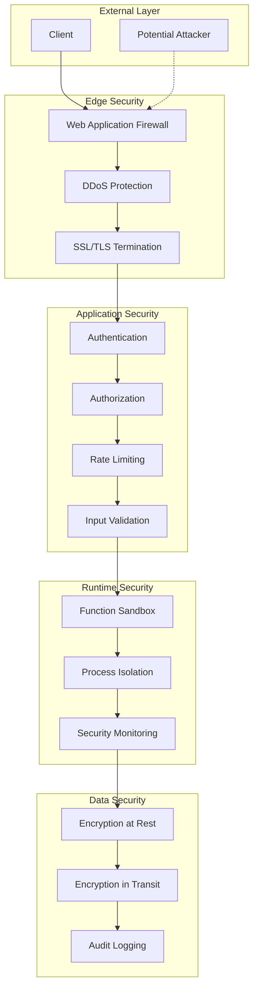

# 🔒 Security & Authentication Guide

## Overview

Dieses Dokument beschreibt die Security-Architektur und Best Practices für den Voice Chat GPT Proxy. Die Implementierung folgt dem Defense-in-Depth Prinzip mit mehreren Sicherheitsebenen.

## Security Architecture



## Authentication Methods

### 1. JWT Token Authentication

```typescript
interface JWTPayload {
  sub: string;          // User ID
  iat: number;          // Issued at
  exp: number;          // Expiration
  scope: string[];      // Permissions
  clientId: string;     // Client identifier
  sessionId?: string;   // Optional session binding
}

// Token generation
function generateToken(user: User): string {
  const payload: JWTPayload = {
    sub: user.id,
    iat: Math.floor(Date.now() / 1000),
    exp: Math.floor(Date.now() / 1000) + (60 * 60), // 1 hour
    scope: user.permissions,
    clientId: user.clientId
  };
  
  return jwt.sign(payload, process.env.JWT_SECRET, {
    algorithm: 'RS256',
    issuer: 'voice-proxy',
    audience: 'voice-proxy-api'
  });
}

// Token validation
async function validateToken(token: string): Promise<JWTPayload> {
  try {
    const decoded = jwt.verify(token, process.env.JWT_PUBLIC_KEY, {
      algorithms: ['RS256'],
      issuer: 'voice-proxy',
      audience: 'voice-proxy-api'
    });
    
    // Additional validation
    if (await isTokenRevoked(decoded.jti)) {
      throw new Error('Token has been revoked');
    }
    
    return decoded as JWTPayload;
  } catch (error) {
    throw new AuthenticationError('Invalid token');
  }
}
```

### 2. API Key Authentication

```typescript
interface APIKey {
  key: string;
  clientId: string;
  name: string;
  permissions: string[];
  rateLimit: {
    requests: number;
    window: number;
  };
  expiresAt?: Date;
  lastUsed: Date;
  ipWhitelist?: string[];
}

// API Key validation
async function validateAPIKey(
  key: string,
  ipAddress: string
): Promise<APIKey> {
  // Hash the key for storage
  const hashedKey = crypto
    .createHash('sha256')
    .update(key)
    .digest('hex');
  
  const apiKey = await db.apiKeys.findOne({ 
    hashedKey,
    active: true 
  });
  
  if (!apiKey) {
    throw new AuthenticationError('Invalid API key');
  }
  
  // Check expiration
  if (apiKey.expiresAt && apiKey.expiresAt < new Date()) {
    throw new AuthenticationError('API key expired');
  }
  
  // Check IP whitelist
  if (apiKey.ipWhitelist && !apiKey.ipWhitelist.includes(ipAddress)) {
    throw new AuthenticationError('IP not whitelisted');
  }
  
  // Update last used
  await db.apiKeys.updateOne(
    { _id: apiKey._id },
    { $set: { lastUsed: new Date() } }
  );
  
  return apiKey;
}
```

### 3. OAuth 2.0 Integration

```typescript
// OAuth configuration
const oauthConfig = {
  google: {
    clientId: process.env.GOOGLE_CLIENT_ID,
    clientSecret: process.env.GOOGLE_CLIENT_SECRET,
    redirectUri: 'https://api.example.com/auth/google/callback',
    scope: ['openid', 'email', 'profile']
  },
  github: {
    clientId: process.env.GITHUB_CLIENT_ID,
    clientSecret: process.env.GITHUB_CLIENT_SECRET,
    redirectUri: 'https://api.example.com/auth/github/callback',
    scope: ['user:email']
  }
};

// OAuth flow implementation
class OAuthHandler {
  async handleCallback(
    provider: string,
    code: string
  ): Promise<User> {
    // Exchange code for token
    const token = await this.exchangeCodeForToken(provider, code);
    
    // Get user info
    const userInfo = await this.getUserInfo(provider, token);
    
    // Create or update user
    const user = await this.findOrCreateUser(provider, userInfo);
    
    // Generate session token
    const sessionToken = generateToken(user);
    
    return { user, token: sessionToken };
  }
}
```

## Authorization & Permissions

### Role-Based Access Control (RBAC)

```typescript
enum Role {
  ADMIN = 'admin',
  USER = 'user',
  DEVELOPER = 'developer',
  VIEWER = 'viewer'
}

enum Permission {
  // Function permissions
  FUNCTION_REGISTER = 'function:register',
  FUNCTION_EXECUTE = 'function:execute',
  FUNCTION_DELETE = 'function:delete',
  
  // Session permissions
  SESSION_CREATE = 'session:create',
  SESSION_READ = 'session:read',
  SESSION_DELETE = 'session:delete',
  
  // Audio permissions
  AUDIO_STREAM = 'audio:stream',
  AUDIO_TRANSCRIBE = 'audio:transcribe',
  
  // Admin permissions
  ADMIN_USERS = 'admin:users',
  ADMIN_STATS = 'admin:stats'
}

const rolePermissions: Record<Role, Permission[]> = {
  [Role.ADMIN]: [
    Permission.FUNCTION_REGISTER,
    Permission.FUNCTION_EXECUTE,
    Permission.FUNCTION_DELETE,
    Permission.SESSION_CREATE,
    Permission.SESSION_READ,
    Permission.SESSION_DELETE,
    Permission.AUDIO_STREAM,
    Permission.AUDIO_TRANSCRIBE,
    Permission.ADMIN_USERS,
    Permission.ADMIN_STATS
  ],
  [Role.DEVELOPER]: [
    Permission.FUNCTION_REGISTER,
    Permission.FUNCTION_EXECUTE,
    Permission.SESSION_CREATE,
    Permission.SESSION_READ,
    Permission.AUDIO_STREAM,
    Permission.AUDIO_TRANSCRIBE
  ],
  [Role.USER]: [
    Permission.FUNCTION_EXECUTE,
    Permission.SESSION_CREATE,
    Permission.SESSION_READ,
    Permission.AUDIO_STREAM
  ],
  [Role.VIEWER]: [
    Permission.SESSION_READ
  ]
};

// Permission check middleware
function requirePermission(permission: Permission) {
  return async (req: Request, res: Response, next: NextFunction) => {
    const user = req.user;
    
    if (!user) {
      return res.status(401).json({ error: 'Unauthorized' });
    }
    
    const userPermissions = rolePermissions[user.role] || [];
    
    if (!userPermissions.includes(permission)) {
      return res.status(403).json({ error: 'Forbidden' });
    }
    
    next();
  };
}
```

### Attribute-Based Access Control (ABAC)

```typescript
interface AccessPolicy {
  resource: string;
  action: string;
  conditions: {
    userAttributes?: Record<string, any>;
    resourceAttributes?: Record<string, any>;
    environmentAttributes?: Record<string, any>;
  };
}

class ABACEngine {
  async evaluate(
    user: User,
    resource: any,
    action: string,
    environment: any
  ): Promise<boolean> {
    const policies = await this.getPolicies(resource.type, action);
    
    for (const policy of policies) {
      if (this.evaluatePolicy(policy, user, resource, environment)) {
        return true;
      }
    }
    
    return false;
  }
  
  private evaluatePolicy(
    policy: AccessPolicy,
    user: User,
    resource: any,
    environment: any
  ): boolean {
    // Check user attributes
    if (policy.conditions.userAttributes) {
      for (const [key, value] of Object.entries(policy.conditions.userAttributes)) {
        if (user[key] !== value) return false;
      }
    }
    
    // Check resource attributes
    if (policy.conditions.resourceAttributes) {
      for (const [key, value] of Object.entries(policy.conditions.resourceAttributes)) {
        if (resource[key] !== value) return false;
      }
    }
    
    // Check environment attributes
    if (policy.conditions.environmentAttributes) {
      for (const [key, value] of Object.entries(policy.conditions.environmentAttributes)) {
        if (environment[key] !== value) return false;
      }
    }
    
    return true;
  }
}
```

## Input Validation & Sanitization

### Schema Validation

```typescript
import Ajv from 'ajv';
import addFormats from 'ajv-formats';
import DOMPurify from 'isomorphic-dompurify';

const ajv = new Ajv({ allErrors: true });
addFormats(ajv);

// Add custom formats
ajv.addFormat('safe-string', {
  type: 'string',
  validate: (data: string) => {
    // Check for SQL injection patterns
    const sqlPatterns = /(\b(SELECT|INSERT|UPDATE|DELETE|DROP|UNION|ALTER|CREATE)\b)/gi;
    if (sqlPatterns.test(data)) return false;
    
    // Check for NoSQL injection patterns
    const noSqlPatterns = /(\$\w+:|{"\$)/;
    if (noSqlPatterns.test(data)) return false;
    
    // Check for command injection patterns
    const cmdPatterns = /(;|\||&&|\$\(|`)/;
    if (cmdPatterns.test(data)) return false;
    
    return true;
  }
});

// Function parameter validation schema
const functionParamsSchema = {
  type: 'object',
  properties: {
    name: {
      type: 'string',
      format: 'safe-string',
      minLength: 1,
      maxLength: 100,
      pattern: '^[a-zA-Z0-9_]+$'
    },
    description: {
      type: 'string',
      format: 'safe-string',
      maxLength: 500
    },
    parameters: {
      type: 'object',
      maxProperties: 20
    }
  },
  required: ['name', 'parameters'],
  additionalProperties: false
};

// Validation middleware
function validateInput(schema: any) {
  return (req: Request, res: Response, next: NextFunction) => {
    const validate = ajv.compile(schema);
    
    if (!validate(req.body)) {
      return res.status(400).json({
        error: 'Validation failed',
        details: validate.errors
      });
    }
    
    // Additional sanitization
    req.body = sanitizeInput(req.body);
    
    next();
  };
}

// Input sanitization
function sanitizeInput(input: any): any {
  if (typeof input === 'string') {
    // Remove HTML/JS
    input = DOMPurify.sanitize(input, { 
      ALLOWED_TAGS: [],
      ALLOWED_ATTR: [] 
    });
    
    // Trim whitespace
    input = input.trim();
    
    // Escape special characters
    input = input.replace(/[<>&'"]/g, (char) => {
      const entities: Record<string, string> = {
        '<': '&lt;',
        '>': '&gt;',
        '&': '&amp;',
        "'": '&#x27;',
        '"': '&quot;'
      };
      return entities[char];
    });
  } else if (typeof input === 'object' && input !== null) {
    for (const key in input) {
      input[key] = sanitizeInput(input[key]);
    }
  }
  
  return input;
}
```

## Rate Limiting

### Multi-Layer Rate Limiting

```typescript
import { RateLimiterRedis } from 'rate-limiter-flexible';

// Global rate limiter
const globalLimiter = new RateLimiterRedis({
  storeClient: redisClient,
  keyPrefix: 'global',
  points: 10000,        // Number of requests
  duration: 60,         // Per minute
  blockDuration: 60     // Block for 1 minute
});

// Per-user rate limiter
const userLimiter = new RateLimiterRedis({
  storeClient: redisClient,
  keyPrefix: 'user',
  points: 100,
  duration: 60,
  blockDuration: 300    // Block for 5 minutes
});

// Per-endpoint rate limiter
const endpointLimiters = {
  '/api/functions': new RateLimiterRedis({
    storeClient: redisClient,
    keyPrefix: 'endpoint:functions',
    points: 50,
    duration: 60
  }),
  '/ws': new RateLimiterRedis({
    storeClient: redisClient,
    keyPrefix: 'endpoint:ws',
    points: 5,
    duration: 60
  })
};

// Function call rate limiter
const functionLimiter = new RateLimiterRedis({
  storeClient: redisClient,
  keyPrefix: 'function',
  points: 1000,
  duration: 3600        // Per hour
});

// Rate limiting middleware
async function rateLimitMiddleware(
  req: Request,
  res: Response,
  next: NextFunction
) {
  try {
    // Global rate limit
    await globalLimiter.consume(req.ip);
    
    // User-specific rate limit
    if (req.user) {
      await userLimiter.consume(req.user.id);
    }
    
    // Endpoint-specific rate limit
    const endpointLimiter = endpointLimiters[req.path];
    if (endpointLimiter) {
      await endpointLimiter.consume(req.ip);
    }
    
    next();
  } catch (rejRes) {
    res.status(429).json({
      error: 'Too many requests',
      retryAfter: Math.round(rejRes.msBeforeNext / 1000) || 60
    });
  }
}
```

## Function Execution Security

### Sandbox Implementation

```typescript
import { VM } from 'vm2';
import { Worker } from 'worker_threads';

class FunctionSandbox {
  private readonly timeout = 5000;
  private readonly memoryLimit = 128 * 1024 * 1024; // 128MB
  
  async executeInVM(code: string, args: any): Promise<any> {
    const vm = new VM({
      timeout: this.timeout,
      sandbox: {
        args,
        console: this.createSafeConsole(),
        setTimeout: undefined,
        setInterval: undefined,
        setImmediate: undefined,
        process: undefined,
        require: undefined,
        __dirname: undefined,
        __filename: undefined,
        module: undefined,
        exports: undefined,
        global: undefined
      },
      eval: false,
      wasm: false
    });
    
    try {
      const result = vm.run(`
        (function() {
          ${code}
        })()
      `);
      
      return result;
    } catch (error) {
      throw new Error(`Function execution failed: ${error.message}`);
    }
  }
  
  async executeInWorker(code: string, args: any): Promise<any> {
    return new Promise((resolve, reject) => {
      const worker = new Worker(`
        const { parentPort } = require('worker_threads');
        
        parentPort.on('message', ({ code, args }) => {
          try {
            const fn = new Function('args', code);
            const result = fn(args);
            parentPort.postMessage({ success: true, result });
          } catch (error) {
            parentPort.postMessage({ 
              success: false, 
              error: error.message 
            });
          }
        });
      `, { 
        eval: true,
        resourceLimits: {
          maxOldGenerationSizeMb: 128,
          maxYoungGenerationSizeMb: 32
        }
      });
      
      const timeout = setTimeout(() => {
        worker.terminate();
        reject(new Error('Function execution timeout'));
      }, this.timeout);
      
      worker.on('message', (message) => {
        clearTimeout(timeout);
        worker.terminate();
        
        if (message.success) {
          resolve(message.result);
        } else {
          reject(new Error(message.error));
        }
      });
      
      worker.on('error', (error) => {
        clearTimeout(timeout);
        worker.terminate();
        reject(error);
      });
      
      worker.postMessage({ code, args });
    });
  }
  
  private createSafeConsole() {
    return {
      log: (...args: any[]) => {
        // Log to secure location
        logger.info('Sandbox console.log:', args);
      },
      error: (...args: any[]) => {
        logger.error('Sandbox console.error:', args);
      },
      warn: (...args: any[]) => {
        logger.warn('Sandbox console.warn:', args);
      }
    };
  }
}
```

## Encryption

### Data Encryption

```typescript
import crypto from 'crypto';

class EncryptionService {
  private readonly algorithm = 'aes-256-gcm';
  private readonly keyDerivationIterations = 100000;
  
  // Encrypt sensitive data
  encrypt(text: string, password: string): EncryptedData {
    const salt = crypto.randomBytes(32);
    const key = crypto.pbkdf2Sync(
      password,
      salt,
      this.keyDerivationIterations,
      32,
      'sha256'
    );
    
    const iv = crypto.randomBytes(16);
    const cipher = crypto.createCipheriv(this.algorithm, key, iv);
    
    let encrypted = cipher.update(text, 'utf8', 'hex');
    encrypted += cipher.final('hex');
    
    const authTag = cipher.getAuthTag();
    
    return {
      encrypted,
      salt: salt.toString('hex'),
      iv: iv.toString('hex'),
      authTag: authTag.toString('hex')
    };
  }
  
  // Decrypt sensitive data
  decrypt(encryptedData: EncryptedData, password: string): string {
    const key = crypto.pbkdf2Sync(
      password,
      Buffer.from(encryptedData.salt, 'hex'),
      this.keyDerivationIterations,
      32,
      'sha256'
    );
    
    const decipher = crypto.createDecipheriv(
      this.algorithm,
      key,
      Buffer.from(encryptedData.iv, 'hex')
    );
    
    decipher.setAuthTag(Buffer.from(encryptedData.authTag, 'hex'));
    
    let decrypted = decipher.update(encryptedData.encrypted, 'hex', 'utf8');
    decrypted += decipher.final('utf8');
    
    return decrypted;
  }
  
  // Hash passwords
  async hashPassword(password: string): Promise<string> {
    const salt = crypto.randomBytes(16);
    return new Promise((resolve, reject) => {
      crypto.scrypt(password, salt, 64, (err, derivedKey) => {
        if (err) reject(err);
        resolve(salt.toString('hex') + ':' + derivedKey.toString('hex'));
      });
    });
  }
  
  // Verify passwords
  async verifyPassword(password: string, hash: string): Promise<boolean> {
    const [salt, key] = hash.split(':');
    return new Promise((resolve, reject) => {
      crypto.scrypt(password, Buffer.from(salt, 'hex'), 64, (err, derivedKey) => {
        if (err) reject(err);
        resolve(key === derivedKey.toString('hex'));
      });
    });
  }
}

interface EncryptedData {
  encrypted: string;
  salt: string;
  iv: string;
  authTag: string;
}
```

## Audit Logging

### Comprehensive Audit System

```typescript
interface AuditLog {
  id: string;
  timestamp: Date;
  userId?: string;
  clientId: string;
  ipAddress: string;
  userAgent: string;
  action: string;
  resource: string;
  result: 'success' | 'failure';
  metadata?: Record<string, any>;
  errorDetails?: any;
}

class AuditLogger {
  private readonly sensitiveFields = [
    'password',
    'token',
    'apiKey',
    'secret',
    'authorization'
  ];
  
  async log(entry: Partial<AuditLog>): Promise<void> {
    const auditEntry: AuditLog = {
      id: crypto.randomUUID(),
      timestamp: new Date(),
      result: 'success',
      ...entry,
      metadata: this.sanitizeMetadata(entry.metadata)
    };
    
    // Store in database
    await db.auditLogs.insert(auditEntry);
    
    // Send to SIEM
    await this.sendToSIEM(auditEntry);
    
    // Alert on suspicious activity
    if (this.isSuspicious(auditEntry)) {
      await this.alertSecurityTeam(auditEntry);
    }
  }
  
  private sanitizeMetadata(metadata?: Record<string, any>): Record<string, any> {
    if (!metadata) return {};
    
    const sanitized = { ...metadata };
    
    for (const field of this.sensitiveFields) {
      if (field in sanitized) {
        sanitized[field] = '[REDACTED]';
      }
    }
    
    return sanitized;
  }
  
  private isSuspicious(entry: AuditLog): boolean {
    // Multiple failed auth attempts
    if (entry.action === 'auth.login' && entry.result === 'failure') {
      return this.checkFailedAuthAttempts(entry.ipAddress) > 5;
    }
    
    // Unusual time access
    const hour = entry.timestamp.getHours();
    if (hour < 6 || hour > 22) {
      return true;
    }
    
    // Rapid function calls
    if (entry.action.startsWith('function.')) {
      return this.checkRapidFunctionCalls(entry.userId) > 100;
    }
    
    return false;
  }
  
  private async sendToSIEM(entry: AuditLog): Promise<void> {
    // Send to Splunk, ELK, etc.
    await fetch(process.env.SIEM_ENDPOINT, {
      method: 'POST',
      headers: {
        'Content-Type': 'application/json',
        'Authorization': `Bearer ${process.env.SIEM_TOKEN}`
      },
      body: JSON.stringify(entry)
    });
  }
  
  private async alertSecurityTeam(entry: AuditLog): Promise<void> {
    // Send alert via Slack, PagerDuty, etc.
    await fetch(process.env.ALERT_WEBHOOK, {
      method: 'POST',
      headers: { 'Content-Type': 'application/json' },
      body: JSON.stringify({
        text: `Security Alert: Suspicious activity detected`,
        attachments: [{
          color: 'danger',
          fields: [
            { title: 'Action', value: entry.action },
            { title: 'User', value: entry.userId || 'Unknown' },
            { title: 'IP', value: entry.ipAddress },
            { title: 'Time', value: entry.timestamp.toISOString() }
          ]
        }]
      })
    });
  }
}
```

## Security Headers

### HTTP Security Headers

```typescript
import helmet from 'helmet';

app.use(helmet({
  contentSecurityPolicy: {
    directives: {
      defaultSrc: ["'self'"],
      scriptSrc: ["'self'", "'unsafe-inline'"],
      styleSrc: ["'self'", "'unsafe-inline'"],
      imgSrc: ["'self'", "data:", "https:"],
      connectSrc: ["'self'", "wss:", "https:"],
      fontSrc: ["'self'"],
      objectSrc: ["'none'"],
      mediaSrc: ["'self'"],
      frameSrc: ["'none'"],
      sandbox: ['allow-forms', 'allow-scripts', 'allow-same-origin'],
      reportUri: '/api/csp-report',
      upgradeInsecureRequests: []
    }
  },
  hsts: {
    maxAge: 31536000,
    includeSubDomains: true,
    preload: true
  },
  noSniff: true,
  xssFilter: true,
  referrerPolicy: { policy: 'same-origin' },
  permittedCrossDomainPolicies: false
}));

// Additional security headers
app.use((req, res, next) => {
  res.setHeader('X-Frame-Options', 'DENY');
  res.setHeader('X-Content-Type-Options', 'nosniff');
  res.setHeader('Permissions-Policy', 'geolocation=(), microphone=(), camera=()');
  res.setHeader('X-Permitted-Cross-Domain-Policies', 'none');
  next();
});
```

## CORS Configuration

```typescript
import cors from 'cors';

const corsOptions: cors.CorsOptions = {
  origin: (origin, callback) => {
    const allowedOrigins = process.env.CORS_ORIGINS?.split(',') || [];
    
    // Allow requests with no origin (mobile apps, Postman, etc.)
    if (!origin) return callback(null, true);
    
    if (allowedOrigins.includes(origin)) {
      callback(null, true);
    } else {
      callback(new Error('Not allowed by CORS'));
    }
  },
  credentials: true,
  methods: ['GET', 'POST', 'PUT', 'DELETE', 'OPTIONS'],
  allowedHeaders: ['Content-Type', 'Authorization', 'X-Request-ID'],
  exposedHeaders: ['X-RateLimit-Limit', 'X-RateLimit-Remaining'],
  maxAge: 86400 // 24 hours
};

app.use(cors(corsOptions));
```

## Security Monitoring

### Real-time Threat Detection

```typescript
class SecurityMonitor {
  private patterns = {
    sqlInjection: /(\b(SELECT|INSERT|UPDATE|DELETE|DROP|UNION)\b)/gi,
    xss: /<script|javascript:|onerror=/gi,
    pathTraversal: /\.\.\//g,
    commandInjection: /(;|\||&&|\$\(|`)/g
  };
  
  async monitorRequest(req: Request): Promise<void> {
    const threats = [];
    
    // Check for attack patterns
    const requestData = JSON.stringify({
      body: req.body,
      query: req.query,
      params: req.params
    });
    
    for (const [type, pattern] of Object.entries(this.patterns)) {
      if (pattern.test(requestData)) {
        threats.push({
          type,
          timestamp: new Date(),
          ip: req.ip,
          path: req.path,
          data: requestData
        });
      }
    }
    
    if (threats.length > 0) {
      await this.handleThreats(threats);
    }
  }
  
  private async handleThreats(threats: any[]): Promise<void> {
    // Log threats
    for (const threat of threats) {
      logger.security('Threat detected', threat);
    }
    
    // Block IP if multiple threats
    if (threats.length > 3) {
      await this.blockIP(threats[0].ip);
    }
    
    // Alert security team
    await this.alertSecurityTeam(threats);
  }
  
  private async blockIP(ip: string): Promise<void> {
    await redisClient.setex(
      `blocked:${ip}`,
      3600, // Block for 1 hour
      JSON.stringify({
        reason: 'Multiple security threats detected',
        timestamp: new Date()
      })
    );
  }
}
```

## Compliance

### GDPR Compliance

```typescript
class GDPRCompliance {
  // Data portability
  async exportUserData(userId: string): Promise<any> {
    const data = {
      profile: await db.users.findOne({ id: userId }),
      sessions: await db.sessions.find({ userId }),
      functions: await db.functions.find({ userId }),
      auditLogs: await db.auditLogs.find({ userId })
    };
    
    return this.sanitizeExportData(data);
  }
  
  // Right to erasure
  async deleteUserData(userId: string): Promise<void> {
    // Delete user data
    await db.users.deleteOne({ id: userId });
    await db.sessions.deleteMany({ userId });
    await db.functions.deleteMany({ userId });
    
    // Anonymize audit logs (keep for legal requirements)
    await db.auditLogs.updateMany(
      { userId },
      { $set: { userId: 'DELETED', metadata: {} } }
    );
  }
  
  // Consent management
  async updateConsent(
    userId: string,
    consent: ConsentPreferences
  ): Promise<void> {
    await db.users.updateOne(
      { id: userId },
      { $set: { consent, consentUpdatedAt: new Date() } }
    );
  }
}

interface ConsentPreferences {
  analytics: boolean;
  marketing: boolean;
  functionalCookies: boolean;
  thirdPartySharing: boolean;
}
```

## Security Checklist

### Development
- [ ] Use latest dependencies
- [ ] Run security linters (ESLint security plugin)
- [ ] Implement proper error handling
- [ ] Never log sensitive data
- [ ] Use environment variables for secrets
- [ ] Implement proper session management
- [ ] Use secure random generators
- [ ] Validate all inputs
- [ ] Sanitize all outputs
- [ ] Use parameterized queries

### Deployment
- [ ] Enable HTTPS everywhere
- [ ] Configure security headers
- [ ] Implement rate limiting
- [ ] Set up WAF rules
- [ ] Configure DDoS protection
- [ ] Enable audit logging
- [ ] Set up security monitoring
- [ ] Configure backup and recovery
- [ ] Implement intrusion detection
- [ ] Regular security scans

### Operations
- [ ] Regular dependency updates
- [ ] Security patch management
- [ ] Access control reviews
- [ ] Security training for team
- [ ] Incident response plan
- [ ] Regular penetration testing
- [ ] Compliance audits
- [ ] Disaster recovery testing
- [ ] Log analysis and monitoring
- [ ] Key rotation schedule